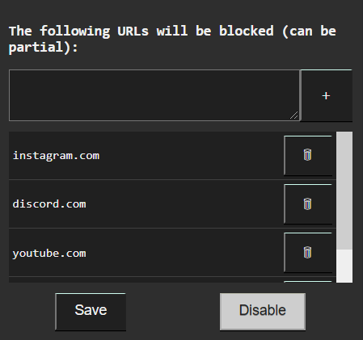
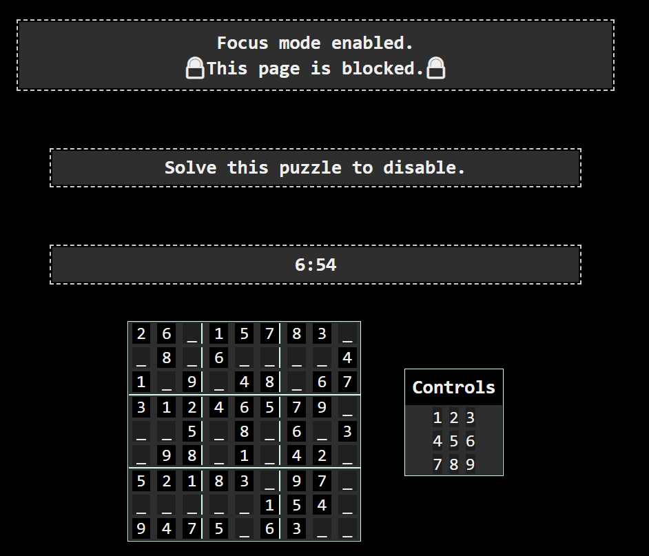
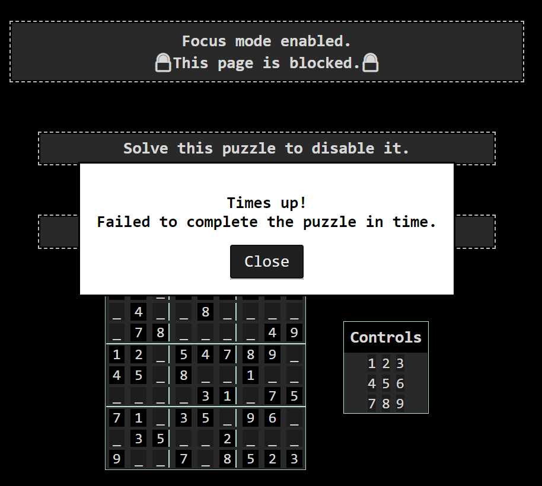

# Focus
## Productivity browser extension.
## You have to solve a sudoku puzzle in order to disable the Focus mode.

## To be fixed:
- 'invalid' id should be present on selectable components on conflict
- 'invalid' id should be removed after the number is valid
- Countdown timer should present the correct time when it's <= 10 secs

### Popup window where you can set the specific urls

### Initial screen displaying the block

### Success screen

### Failure screen

